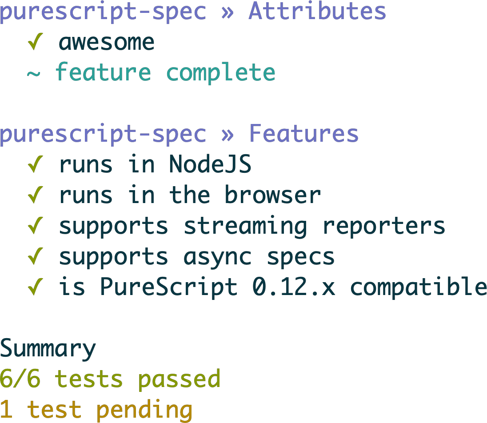

# purescript-spec



## Usage

```bash
bower install purescript-spec
```

Then in a `Main.purs` file...

```purescript
module Main where

import Test.Spec
import Test.Spec.Runner
import Test.Spec.Assertions

main = suite $
  describe "Math" do
    it "does addition" do
      (1 + 1) `shouldEqual` 2
    it "fails as well" do
      (1 + 1) `shouldEqual` 3
    pending "will do stuff in the future"
```

## API

See [API](API.md).

## Build

```bash
# Make the library
make
# Run tests
make run-tests
# Generate docs
make docs
# Generate example.png, requires phantomjs and aha installed.
make example.png
```

## License

[MIT License](LICENSE.md).
